# Prácticas de MongoDB

## Primeros Comandos

### Iniciar el contenedor de Docker y acceder a la base de datos:
```bash
docker start example-mongo
docker exec -it example-mongo bash
mongosh

```
___
## Ejecutar comandos basicos

```
use practica1
show dbs
show collections
db.createCollection("facturas")
db.facturas.insertOne({
    Cod_factura: 10,
    Cliente: "Frutas Ramirez",
    Total: 223
})
db.facturas.find()
db.productos.insertOne({
    Cod_producto: 2,
    Nombre: "Martillo X2",
    Precio: 20,
    Unidades: 50,
    Fabricantes: ["Fab1", "Fab2", "Fab3", "Fab4"]
})
db.fabricantes.insertOne({
    _id: 1,
    Nombre: "Fab1",
    Localidad: { Ciudad: "Buenos Aires", Pais: "Argentina", Calle: "Calle Pez 27", Cod: 29000 }
})
```
___
## Borrar documentos 
```
db.facturas.deleteOne({ Cliente: "Frutas Ramirez" })

```
___
## Borrar documentos con un total mayor de 200
```
db.facturas.deleteMany({ Total: { $gt: 200 } })

```
___
## Practica de Mongo con find
___
##### Entrar al docker de mongo

___
##### Creacion de una Base de datos denominada practica1
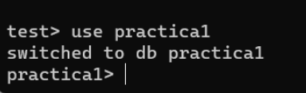
___
##### Usar el show dbs
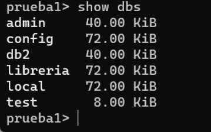
___
##### Creacion de una colección denominada “facturas” 
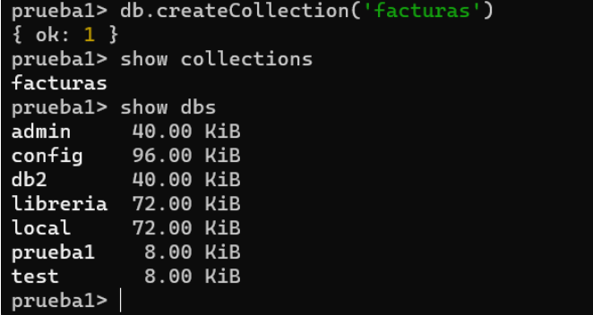
___
##### Insertar un documento 
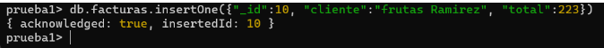
___
##### comprobar que se realizo la insercion
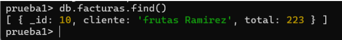
___
##### Insertar una nueva fila en facturas y comprobar con un “find”
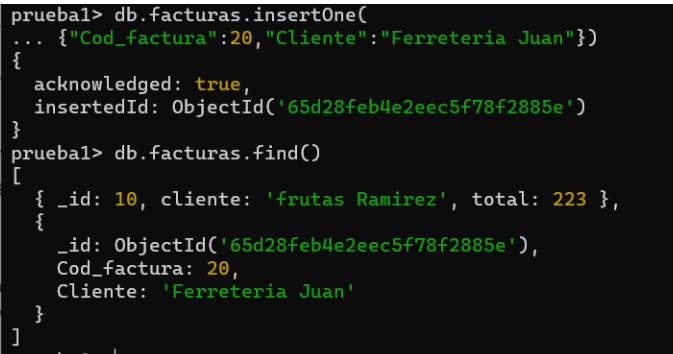
___
##### Insertamos un documento en una colección que no existe (productos)  
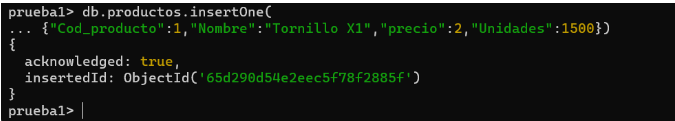
___
##### Hacemos un “show collections” para comprobar que se ha creado 
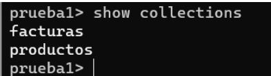
___

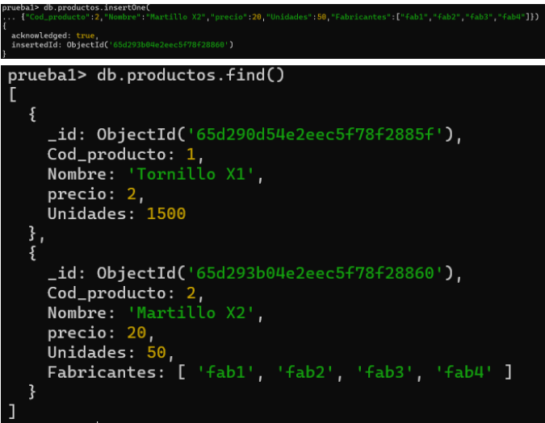
___
##### Hacemos un find() para comprobar el resultado y comprobamos que se ha borrado
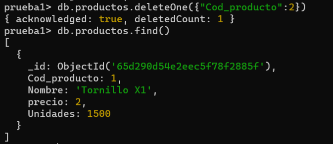
___
##### insertar un documento en una colección denominada “fabricantes” para probar los subdocumentos y la clave “_id” personalizada.

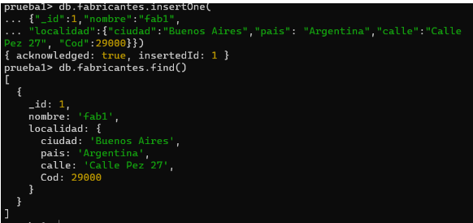
___
##### Comprobar con el find que se han creado
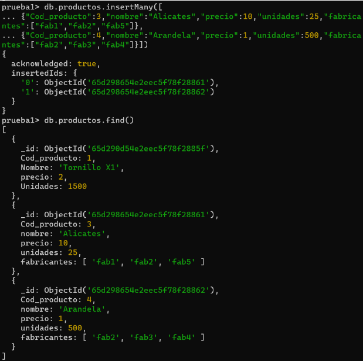
___
## Consultas
##### Importacion de la base de datos "empleados"
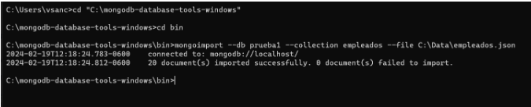
___
##### Usar find para comprobar que se importo correctamente
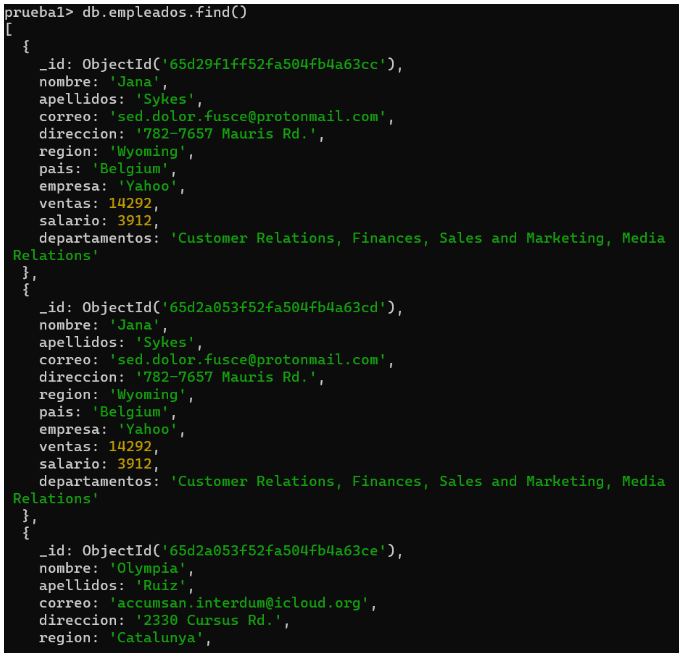
___
* Buscar todas los empleados que trabajen en Google
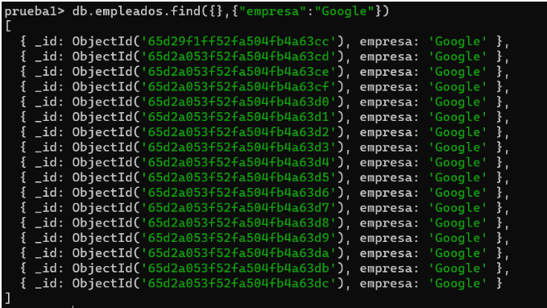
___
* Empleados que vivan en Peru
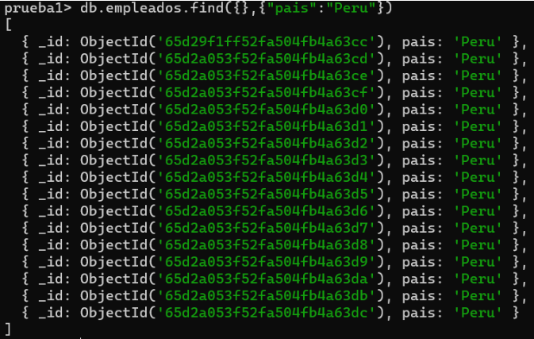
___
* Empleados que ganen más de 8.000 dolares
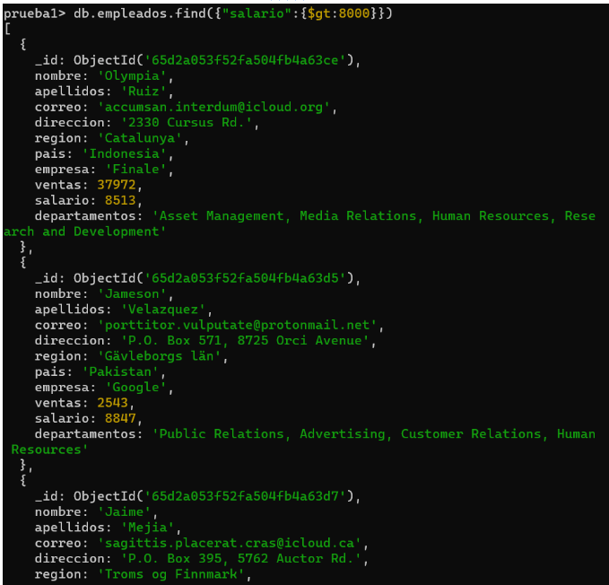
___
* Empleados con ventas inferiores a 10000
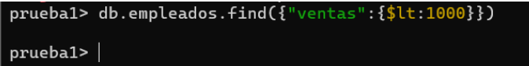
___
* Hacer el comando anterior pero devolviendo una sola fila
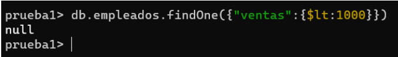
___
* Empleados que trabajen en Google o en Yahoo con el operador $or
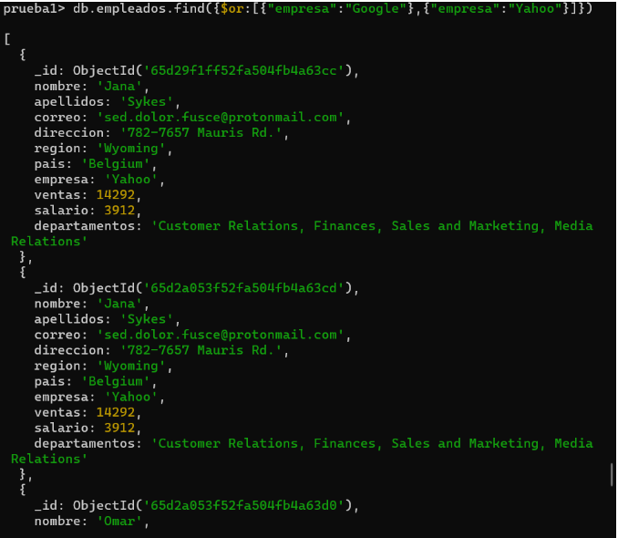
___
* Empleados que trabajen en Google o en Yahoo con el operador $in 
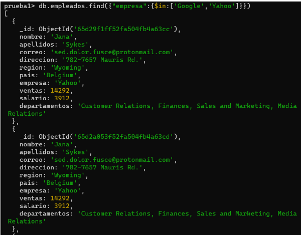
___
* Empleados de Amazon que ganen mas de 9000 dolares
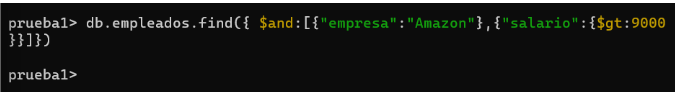
___
* Empleados que trabajen en Yahoo que ganen mas de 6000 o empleados que trabajen en Google que tangan ventas inferiores a 20000

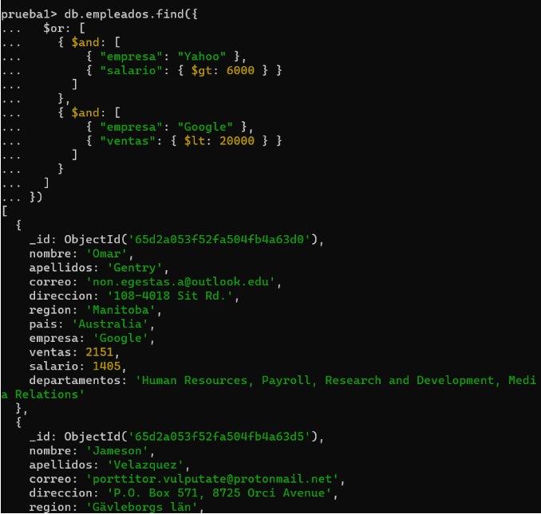
___
* Visualizar el nombre, apellidos y el país de cada empleado
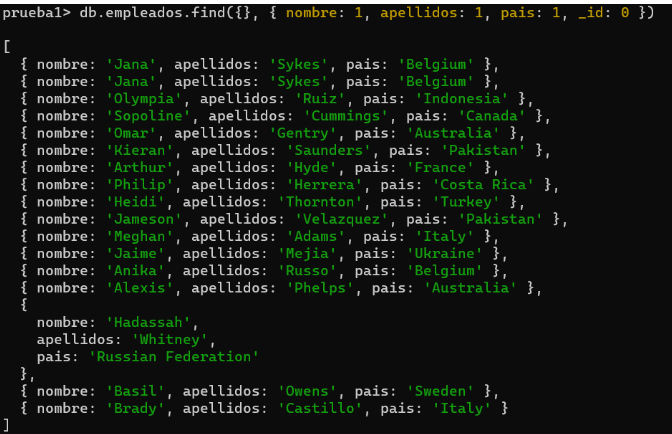

```

```
___
## Practica de Mongo con agregaciones

#### pipeline 1:
```
db.getCollection('libros').aggregate(
  [
    { $match: { editorial: 'Biblio' } },
    {
      $project: {
        _id: 0,
        titulo: 1,
        precio: 1,
        cantidad: 1,
        'Nombre Editorial': '$editorial',
        'Total ganancia': {
          $multiply: ['$precio', '$cantidad']
        }
      }
    },
    { $sort: { precio: 1 } }
  ],
  { maxTimeMS: 60000, allowDiskUse: true }
);

```
___
#### pipeline 2:
```
db.getCollection('libros').aggregate(
  [
    {
      $group: {
        _id: '$editorial',
        'Numero documentos': { $count: {} }
      }
    }
  ],
  { maxTimeMS: 60000, allowDiskUse: true }
);

```
___
#### pipeline 3:
```
db.getCollection('libros').aggregate(
  [
    {
      $group: {
        _id: '$editorial',
        'Numero de docs': { $count: {} },
        media: { $avg: '$precio' }
      }
    },
    {
      $group: {
        _id: '$editorial',
        'Numero de docs': { $count: {} },
        media: { $avg: '$precio' },
        'Precio maximo': { $max: '$precio' }
      }
    },
    { $sort: { 'Precio maximo': 1 } },
    {
      $group: {
        _id: 'editorial',
        Numero: { $count: {} },
        media: { $avg: '$precio' }
      }
    },
    {
      $set: {
        'Media total': { $trunc: '$media' }
      }
    }
  ],
  { maxTimeMS: 60000, allowDiskUse: true }
);

```
___
#### pipeline 4:
```
db.getCollection('libros').aggregate(
  [{ $unset: 'Media_editoriales' }],
  { maxTimeMS: 60000, allowDiskUse: true }
);

